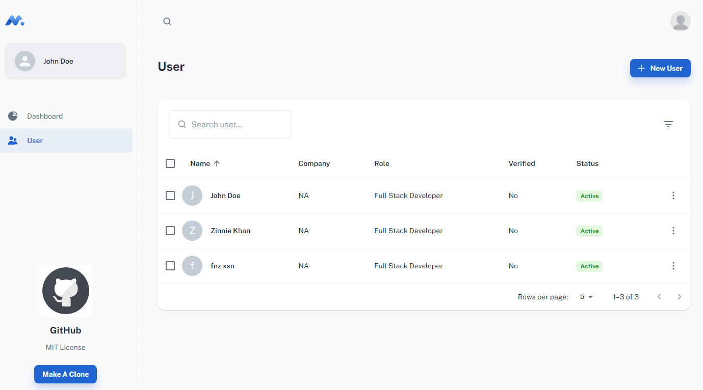
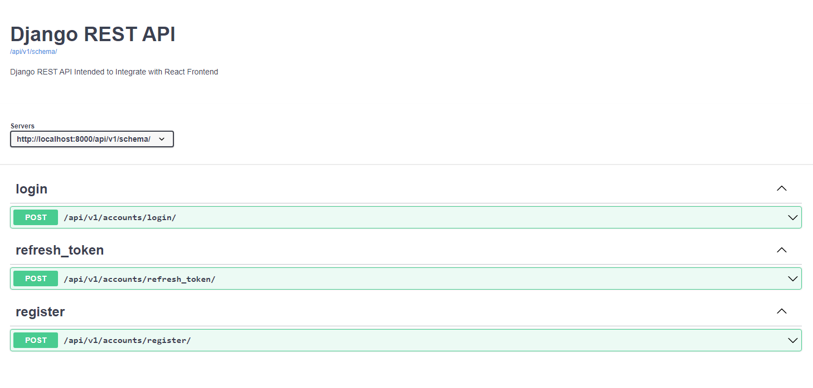

<h1 align="center">Django REST API with React BoilerPlate</h1>

👉 [View Live](https://drf-react-boilerplate.herokuapp.com/)

## Frontend ⭐

- Latest version of React. and React Router Dom ✔
- Material UI Template for clean Design. ✔
- Cleaned Starter Minimal Template ✔
- Auto formatted with Prettier ✔
- React with functional components and hooks ✔
- Redux with proper store configuration in the Minimal Template ✔
- Forms Validation with Formik ✔
- Login , Register and one example of Users list using Material React Table with Search, Filter , Pagination and more ✔
- Server Errors Handling✔

## Backend🛠

- Django REST framework for a powerful API ✔
- Django ORM for interacting with the database✔
- PostgreSQL Config ✔
- Authentication With JWT (SIGN UP and Sign IN) more to come soon...✔
- JWT Token Black Listing✔
- ReadOnly Serializers for better performance ✔
- Throttle setup ✔
- Extra password hashers like `Argon2PasswordHasher` Recommend by official django docs. ✔

## Motivation 🎯

- Minimal Setup of Starter MUI template configured with Django using DRF and Redux⭐
- Robust Styles from Material UI⭐
- Basic and Simple Code examples to understand integration⭐
- More feactuers will also be added pretty soon⭐

## How to Run locally 🚀

    - Install requirements after creating and activating virtual environement

        $ pip install -r requirements/local.txt

    - Create .env file in config and put variables for Secret Key and Database (PostgreSQL) are optional as by default
    IS_POSTGRESQL = False and won't reuired the credentials. If your turn this into True then set the variables for that
    as created in sample.env file

        $ python manage.py makemigrations
        $ python manage.py migrate

    To run UnitTests:
        $ python manage.py test

    API Documentation will be available at`http://localhost:8000/api/v1/docs/`

    Admin available at`http://localhost:8000/admin/`

    - Install dependencies in frontend app using following commands in separate terminal
    - First make sure you have installed Node.js, I used v16.13.1. while upgrading this setup.

    For More info https://nodejs.org/en/

    - Then run following commands in frontend dir

        $ yarn install
        $ yarn start

    -  React app available at`http://localhost:3000/`

👉 [View Live](https://drf-react-boilerplate.herokuapp.com/) 🚀

👉 [Github Pages](https://faisalnazik.github.io/Django-REST-Framework-React-BoilerPlate/)

## ⭐️ Support

Give a ⭐️ if this project helped you!

## License ©

[The MIT License](LICENSE)
