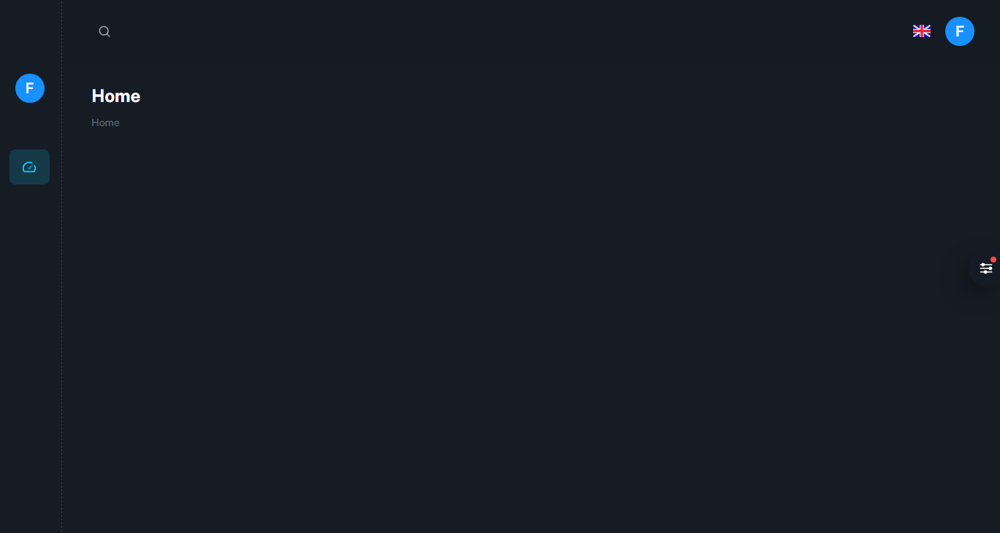
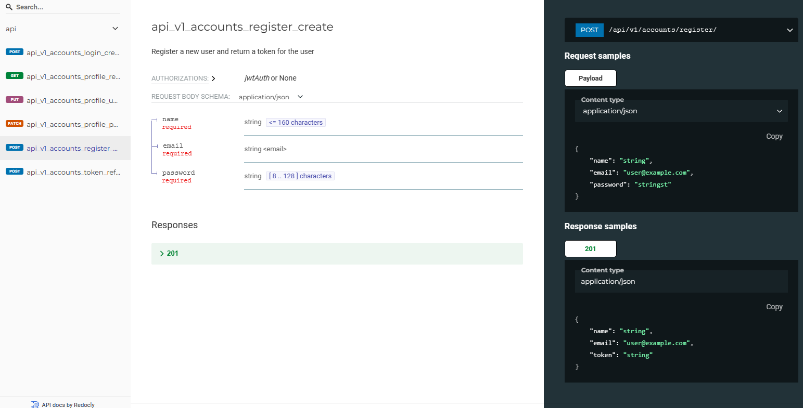

<h1 align="center">Django REST API with React BoilerPlate</h1>

## Frontend ⭐

- Minimal Template with neccessary components✔
- Configured Redux Store✔
- Auto formatted with Prettier ✔
- React with functional components and hooks ✔
- Forms Validation with Formik ✔
- Login , example to understand the JWT auth ✔
- Server Errors Handling✔

## Backend🛠

- Django REST framework for a powerful API ✔
- Django ORM for interacting with the database✔
- Authentication With JWT (SIGN UP and Sign IN) more to come soon...✔
- Throttle setup ✔
- Extra password hashers like `Argon2PasswordHasher` Recommend by official django docs. ✔

## Motivation 🎯

- A quickstart django react boilerplate with updated dependecies to start with react project.
- Robust Styles from Material UI⭐
- Basic and Simple Code examples to understand integration⭐

## How to Run locally 🚀

### Backend

- Install requirements after creating and activating virtual environement

    $ pip install -r requirements/local.txt

    - Currently SQLite is configured, you can change it with any other as well. Then run

    $ python manage.py makemigrations
        $ python manage.py migrate

    To run tests:
        $ pytest

    API Documentation will be available at http://localhost:8000/api/v1/schema/redoc/

    Admin available at`http://localhost:8000/admin/`

### Frontend

    - Install dependencies in frontend app using following commands in separate terminal
    - First make sure you have installed Node.js, v18.12.1. while upgrading this setup.

    For More info https://nodejs.org/en/

    - Then run following commands in frontend dir

    $ yarn install
    $ yarn start

    -  React app available at`http://localhost:3000/`

👉 [Github Pages](https://faisalnazik.github.io/Django-REST-Framework-React-BoilerPlate/)

## ⭐️ Support

Give a ⭐️ if this project helped you!

## License ©

[The MIT License](LICENSE)
